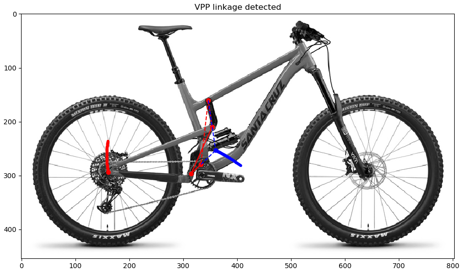

# 4bar-bike-suspension-analysis

Mountain bike suspension analysis for four-bar linkages

## Usage:

* Needs interactive Python shell (iPython, Spyder)
* Add a bike picture (`.jpg`,`.jpeg`) to the  current directory
* Run `4bar_analysis.py`

## Features:

* Automatic linkage configuration detection (linkage-driven single pivot, Horst link, Split-pivot, VPP, DW/Maestro link)
* Plot rear axle path

## Python dependencies:

* Python 3 (tested with Python 3.7.0)
* NumPy
* SciPy
* Matplotlib

## ToDo:

* Calculate shock rocker mount path
* Calculate rear wheel/shock travel
* Plot leverage curve
